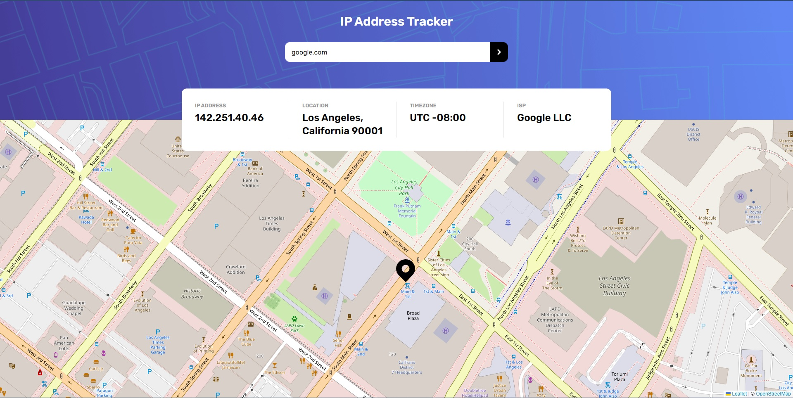

# Frontend Mentor - IP address tracker solution

This is a solution to the [IP address tracker challenge on Frontend Mentor](https://www.frontendmentor.io/challenges/ip-address-tracker-I8-0yYAH0). Frontend Mentor challenges help you improve your coding skills by building realistic projects.

## Table of contents

- [Overview](#overview)
  - [The challenge](#the-challenge)
  - [Screenshot](#screenshot)
  - [Links](#links)
- [My process](#my-process)
  - [Built with](#built-with)
  - [What I learned](#what-i-learned)
  - [Continued development](#continued-development)
- [Author](#author)

**Note: Delete this note and update the table of contents based on what sections you keep.**

## Overview

### The challenge

Users should be able to:

- View the optimal layout for each page depending on their device's screen size
- See hover states for all interactive elements on the page
- See their own IP address on the map on the initial page load
- Search for any IP addresses or domains and see the key information and location

### Screenshot

### Links

- Solution URL: [Solution](https://your-solution-url.com)
- Live Site URL: [Demo](https://mike1233.github.io/IP-Address-Tracker-SolidJS/)

## My process

### Built with

- HTML
- Tailwind/Postcss
- SolidJS / Typescript [url](https://www.solidjs.com/guides/getting-started#try-solid)
- Zod [url](https://github.com/colinhacks/zod)
- Axios [url](https://axios-http.com/docs/intro)

### What I learned

During this project I learned to setup my first SolidJS project and got a basic grasp on how to work with the reactivity system. I also got to try out Zod to set up schema's/types for my application.

### Continued development

I want to dive deeper into the workings of Zod specifically to see if i can improve my current and future applications in terms of runtime typechecking/validations of the data.

## Author

- Frontend Mentor - [@mike1233](https://www.frontendmentor.io/profile/mike1233)
- Github - [@mike1233](https://github.com/mike1233)
